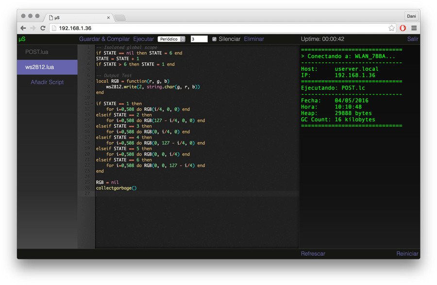

µS
==============================

A general purpouse web server/ide for the esp8266



**Step by Step Guide:**

* Clone this repo and it's submodules.

  ```git --recursive https://github.com/danielesteban/uS.git && cd uS```

* Connect your esp8266 to the computer trough a serial to usb adapter (or similar).

* Connect the GPIO0 of the esp8266 to the ground rail and reset it.
  (This will reboot the esp8266 into the bootloader)

* Flash the firmware.

  ```./util/flash.sh [THE_ESP8266_SERIALPORT]```

  This is just a precompiled version of the [nodemcu-firmware dev branch](https://github.com/nodemcu/nodemcu-firmware/tree/dev)
  with the required modules. Which are: CJSON, FILE, GPIO, HTTP, MDNS, NET, NODE, RTCTIME, SNTP, TMR, WIFI & WS2812.

* Upload the server code & static files.

  ```./util/upload.sh [THE_ESP8266_SERIALPORT]```

* Now you can deploy the esp8266 at it's final location.

* Join the wifi network with SSID: "µS Setup"

* In a web browser, visit:

  ```http://userver.local (or) http://192.168.1.1```

* Once you entered the proper settings into the setup wizard, the esp8266 will restart and connect to your network.
  Once it boots, it will spawn the web server/ide with the mDNS host & password you configured.

* Optionally, it will also update the DDNS record at boot if you configured a noip.com host and auth.

**License:**

The MIT License (MIT)

Copyright (c) 2016 Daniel Esteban Nombela

Permission is hereby granted, free of charge, to any person obtaining a copy
of this software and associated documentation files (the "Software"), to deal
in the Software without restriction, including without limitation the rights
to use, copy, modify, merge, publish, distribute, sublicense, and/or sell
copies of the Software, and to permit persons to whom the Software is
furnished to do so, subject to the following conditions:

The above copyright notice and this permission notice shall be included in
all copies or substantial portions of the Software.

THE SOFTWARE IS PROVIDED "AS IS", WITHOUT WARRANTY OF ANY KIND, EXPRESS OR
IMPLIED, INCLUDING BUT NOT LIMITED TO THE WARRANTIES OF MERCHANTABILITY,
FITNESS FOR A PARTICULAR PURPOSE AND NONINFRINGEMENT. IN NO EVENT SHALL THE
AUTHORS OR COPYRIGHT HOLDERS BE LIABLE FOR ANY CLAIM, DAMAGES OR OTHER
LIABILITY, WHETHER IN AN ACTION OF CONTRACT, TORT OR OTHERWISE, ARISING FROM,
OUT OF OR IN CONNECTION WITH THE SOFTWARE OR THE USE OR OTHER DEALINGS IN
THE SOFTWARE.
